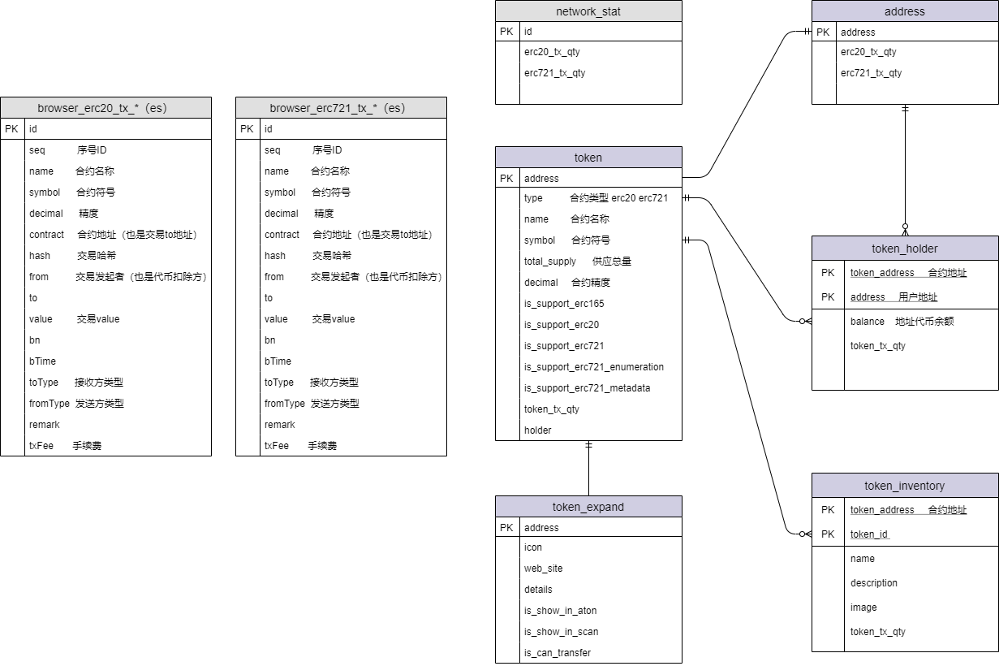

#### 1 Protocol Design

##### 1.1 ERC165 (required)

- function supportsInterface(bytes4 _interfaceID) external view returns (bool)

##### 1.2 ERC721 (required, and inherits ERC165)

- event Transfer(address indexed _from, address indexed _to, uint256 indexed _tokenId)  转账、 tokenId创建（0地址到owner地址）、tokenId销毁（owner地址到0地址）时需要触发事件
- event Approval(address indexed _owner, address indexed _approved, uint256 indexed _tokenId)
- event ApprovalForAll(address indexed _owner, address indexed _operator, bool _approved)
- function safeTransferFrom(address _from, address _to, uint256 _tokenId, bytes calldata _data) external
- function safeTransferFrom(address _from, address _to, uint256 _tokenId) external
- function transferFrom(address _from, address _to, uint256 _tokenId) external;
- function approve(address _approved, uint256 _tokenId) external
- function setApprovalForAll(address _operator, bool _approved) external
- function balanceOf(address _owner) external view returns (uint256)
- function ownerOf(uint256 _tokenId) external view returns (address)
- function getApproved(uint256 _tokenId) external view returns (address)
- function isApprovedForAll(address _owner, address _operator)  external view returns (bool)


##### 1.3 ERC721 metadata (optional, needs to inherit ERC721)

- function name() external view returns (string memory _name)
- function symbol() external view returns (string memory _symbol)
- function tokenURI(uint256 _tokenId) external view returns (string memory)

```
ERC721 Metadata JSON Schema

{
    "title": "Asset Metadata",
    "type": "object",
    "properties": {
        "name": {
            "type": "string",
            "description": "Identifies the asset to which this NFT represents"
        },
        "description": {
            "type": "string",
            "description": "Describes the asset to which this NFT represents"
        },
        "image": {
            "type": "string",
            "description": "A URI pointing to a resource with mime type image/* representing the asset to which this NFT represents. Consider making any images at a width between 320 and 1080 pixels and aspect ratio between 1.91:1 and 4:5 inclusive."
        }
    }
}

```
##### 1.4 ERC721 enumeration (optional, needs to inherit ERC721)

- function totalSupply() external view returns (uint256)
- function tokenByIndex(uint256 _index) external view returns (uint256)
- function tokenOfOwnerByIndex(address _owner, uint256 _index) external view returns (uint256)

##### 1.5 ERC721 token receiver (optional, needs to inherit ERC721)

- function onERC721Received(address _operator, address _from, uint256 _tokenId, bytes calldata _data) external returns(bytes4)

##### 1.6 ERC20

- event Transfer(address indexed _from, address indexed _to, uint256 _value)
- event Approval(address indexed _owner, address indexed _spender, uint256 _value)
- function totalSupply() external view returns (uint256)
- function balanceOf(address _owner) external view returns (uint256 balance)
- function transfer(address _to, uint256 _value) external returns (bool success)
- function transferFrom(address _from, address _to, uint256 _value) external returns (bool success)
- function approve(address _spender, uint256 _value) external returns (bool success)
- function allowance(address _owner, address _spender) external view returns (uint256 remaining)
- function name() public view returns (string)
- function symbol() public view returns (string)
- function decimals() public view returns (uint8)
- function totalSupply() public view returns (uint256)

#### 2 Contract identification

##### 2.1 ERC-165 identification

1. The source contract makes a STATICCALL to the destination address with input data: 0x01ffc9a701ffc9a700000000000000000000000000000000000000000000000000000000 and gas 30,000. This corresponds to contract.supportsInterface(0x01ffc9a7).
2. If the call fails or return false, the destination contract does not implement ERC-165.
3. If the call returns true, a second call is made with input data 0x01ffc9a7ffffffff00000000000000000000000000000000000000000000000000000000.
4. If the second call fails or returns true, the destination contract does not implement ERC-165.
5. Otherwise it implements ERC-165.

```
public boolean isSupportErc165(String contractAddress) throws Exception {
	Transaction transaction = Transaction.createEthCallTransaction(Credentials.create(Keys.createEcKeyPair()).getAddress(), contractAddress,"0x01ffc9a701ffc9a700000000000000000000000000000000000000000000000000000000");
	TurnCall turnCall = web3j.turnCall(transaction, DefaultBlockParameterName.LATEST).send();
	if(!"0x0000000000000000000000000000000000000000000000000000000000000001".equals(turnCall.getResult())){
		return false;
	}

	transaction = Transaction.createEthCallTransaction(Credentials.create(Keys.createEcKeyPair()).getAddress(), contractAddress,"0x01ffc9a7ffffffff00000000000000000000000000000000000000000000000000000000");
	turnCall = web3j.turnCall(transaction, DefaultBlockParameterName.LATEST).send();
	if("0x0000000000000000000000000000000000000000000000000000000000000000".equals(turnCall.getResult())){
		return true;
	}
	return false;
}
```

##### 2.2 ERC-721 identify

1. check support ERC-165.
2. The source contract makes a STATICCALL to the destination address with input data: 0x01ffc9a780ac58cd00000000000000000000000000000000000000000000000000000000 . This corresponds to contract.supportsInterface(0x80ac58cd).

```
public boolean isSupportErc721(String contractAddress) throws Exception {
	Transaction transaction = Transaction.createEthCallTransaction(Credentials.create(Keys.createEcKeyPair()).getAddress(), contractAddress,"0x01ffc9a780ac58cd00000000000000000000000000000000000000000000000000000000");
	TurnCall turnCall = web3j.turnCall(transaction, DefaultBlockParameterName.LATEST).send();
	if("0x0000000000000000000000000000000000000000000000000000000000000001".equals(turnCall.getResult())){
		return true;
	}
	return false;
}
```

##### 2.3 ERC-721 metadata identification

1. check support ERC-165.
2. The source contract makes a STATICCALL to the destination address with input data: 0x01ffc9a75b5e139f000000000000000000000000000000000000000000000000000000 . This corresponds to contract.supportsInterface(0x5b5e139f).


##### 2.4 ERC-721 enumerable identification

1. check support ERC-165.
2. The source contract makes a STATICCALL to the destination address with input data: 0x01ffc9a7780e9d63000000000000000000000000000000000000000000000000000000 . This corresponds to contract.supportsInterface(0x780e9d63).

##### 2.5 ERC-20 identification
1. If it is not erc721
2. check function name()
3. check function symbol()
4. check function decimals()
5. check function totalSupply()

#### 3 Architecture design

##### 3.1 Database design



###### 3.1.1 Add new token table

```
DROP TABLE IF EXISTS `token`;
CREATE TABLE `token` (
  `address` VARCHAR(64) NOT NULL COMMENT 'Contract address',
  `type` VARCHAR(64) NOT NULL COMMENT 'Contract type erc20 erc721',
  `name` VARCHAR(64) COMMENT 'Contract name',
  `symbol` VARCHAR(64) COMMENT 'Contract symbol',
  `total_supply` bigint(80) COMMENT 'Total supply',
  `decimal` bigint(80) COMMENT 'Contract precision',
  `is_support_erc165` tinyint(1) NOT NULL DEFAULT 0 COMMENT 'Whether the erc165 interface is supported: 0-not supported 1-supported',
  `is_support_erc20` tinyint(1) NOT NULL DEFAULT 0 COMMENT 'Whether the erc20 interface is supported: 0-not supported 1-supported',
  `is_support_erc721` tinyint(1) NOT NULL DEFAULT 0 COMMENT 'Whether the erc721 interface is supported: 0-not supported 1-supported',
  `is_support_erc721_enumeration` tinyint(1) NOT NULL DEFAULT 0 COMMENT 'Whether the erc721 enumeration interface is supported: 0-not supported 1-supported',
  `is_support_erc721_metadata` tinyint(1) NOT NULL COMMENT 'Whether the metadata interface is supported: 0-not supported 1-supported',
  `create_time` timestamp NOT NULL DEFAULT CURRENT_TIMESTAMP COMMENT 'Creation time',
  `update_time` timestamp NOT NULL DEFAULT CURRENT_TIMESTAMP ON UPDATE CURRENT_TIMESTAMP COMMENT 'update time',
  PRIMARY KEY (`address`),
  UNIQUE KEY `token_address` (`address`)
)
```
###### 3.1.2 Add token_expand table

```
DROP TABLE IF EXISTS `token_expand`;
CREATE TABLE `token_expand` (
  `address` varchar(64) NOT NULL COMMENT 'Contract address',
  `icon` text COMMENT 'Contract icon',
  `web_site` varchar(256) COMMENT 'Contract official website',
  `details` varchar(256) COMMENT 'Contract details',
  `is_show_in_aton` tinyint(1) DEFAULT '0' COMMENT 'Whether to display in aton, 0-hide 1-show',
  `is_show_in_scan` tinyint(1) DEFAULT '0' COMMENT 'Whether to display in scan, 0-hide 1-show',
  `is_can_transfer` tinyint(1) DEFAULT '0' COMMENT 'Whether it can be transferred 0-cannot be transferred 1-can be transferred',
  `create_id` bigint(20) NOT NULL COMMENT 'Creator',
  `create_name` varchar(50) NOT NULL COMMENT 'creator name',
  `create_time` timestamp NOT NULL DEFAULT CURRENT_TIMESTAMP COMMENT 'Creation time',
  `update_id` bigint(20) NOT NULL COMMENT 'Updater',
  `update_name` varchar(50) NOT NULL COMMENT 'Updater name',
  `update_time` timestamp NOT NULL DEFAULT CURRENT_TIMESTAMP ON UPDATE CURRENT_TIMESTAMP COMMENT 'update time',
  PRIMARY KEY (`address`)
)
```

###### 3.1.3 Add token_holder table

```
DROP TABLE IF EXISTS `token_holder`;
CREATE TABLE `token_holder` (
  `token_address` varchar(64) NOT NULL COMMENT 'Contract address',
  `address` varchar(64) NOT NULL COMMENT 'User address',
  `balance` bigint(80) COMMENT 'Address token balance, ERC20 is the amount, ERC721 is the tokenId number',
  `create_time` timestamp NOT NULL DEFAULT CURRENT_TIMESTAMP COMMENT 'Creation time',
  `update_time` timestamp NOT NULL DEFAULT CURRENT_TIMESTAMP ON UPDATE CURRENT_TIMESTAMP COMMENT 'update time',
  PRIMARY KEY (`token_address`,`address`)
)
```

###### 3.1.4 Added token_inventory table

```
DROP TABLE IF EXISTS `token_inventory`;
CREATE TABLE `token_inventory` (
  `token_address` varchar(64) NOT NULL COMMENT 'Contract address',
  `token_id` bigint(80) NOT NULL COMMENT 'token id',
  `owner` varchar(64) NOT NULL COMMENT 'token id corresponds to the holder address',
  `name` varchar(256) COMMENT 'Identifies the asset to which this NFT represents',
  `description` varchar(256) COMMENT 'Describes the asset to which this NFT represents',
  `image` varchar(256) COMMENT 'A URI pointing to a resource with mime type image/* representing the asset to which this NFT represents. Consider making any images at a width between 320 and 1080 pixels and aspect ratio between 1.91:1 and 4:5 inclusive.',
  `create_time` timestamp NOT NULL DEFAULT CURRENT_TIMESTAMP COMMENT 'Creation time',
  `update_time` timestamp NOT NULL DEFAULT CURRENT_TIMESTAMP ON UPDATE CURRENT_TIMESTAMP COMMENT 'update time',
  PRIMARY KEY (`token_address`,`token_id`)
)
```

###### 3.1.5 Network dimension statistics

```
--The number of erc721 transactions on the entire network
ALTER TABLE `network_stat` ADD COLUMN `erc721_tx_qty` INT(11) DEFAULT 0 NOT NULL COMMENT 'Number of transactions corresponding to erc721 token';

-- Number of erc20 transactions on the entire network
ALTER TABLE `network_stat` ADD COLUMN `erc20_tx_qty` INT(11) DEFAULT 0 NOT NULL COMMENT 'Number of transactions corresponding to erc20 token';

```

###### 3.1.6 Token dimension statistics

```
--The number of erc20 or erc721 transactions generated by the token contract
ALTER TABLE `token` ADD COLUMN `token_tx_qty` INT(11) DEFAULT 0 NOT NULL COMMENT 'Number of transactions corresponding to token';

-- Statistics of the token contract holder
ALTER TABLE `token` ADD COLUMN `holder` INT(11) DEFAULT 0 NOT NULL COMMENT 'the holder corresponding to the token';

```

###### 3.1.7 Inventory dimension statistics under token

```
--The number of erc721 transactions associated with the token contract tokenId
ALTER TABLE `token_inventory` ADD COLUMN `token_tx_qty` INT(11) DEFAULT 0 NOT NULL COMMENT 'Number of transactions corresponding to the token';

```

###### 3.1.8 Statistics of holder dimensions under token

```
--The number of erc20 or erc721 transactions associated with the address under the token
ALTER TABLE `token_holder` ADD COLUMN `token_tx_qty` INT(11) DEFAULT 0 NOT NULL COMMENT 'Number of transactions corresponding to erc721 token';

```

###### 3.1.9 address dimension statistics

```
--The number of erc721 transactions associated with this address
ALTER TABLE `address` ADD COLUMN `erc721_tx_qty` INT(11) DEFAULT 0 NOT NULL COMMENT 'Number of transactions corresponding to erc721 token';

--The number of erc20 transactions associated with this address
ALTER TABLE `address` ADD COLUMN `erc20_tx_qty` INT(11) DEFAULT 0 NOT NULL COMMENT 'Number of transactions corresponding to erc20 token';

```

##### 3.2 Elasticsearch design

##### 3.2.1 *_erc721_tx template

```
{
  "index_patterns": [
    "*_erc721_tx"
  ],
  "settings": {
    "index": {
      "max_result_window": "2000000000",
      "number_of_shards": "5",
      "number_of_replicas": "1"
    }
  },
  "mappings": {
    "properties": {
      "seq": { //Sequence number The block number of the exchange * 100000 + the internal transaction index number of this block
        "type": "long"
      },
      "name": { //name
        "type": "text"
      },
      "symbol": { //Currency symbol
        "type": "keyword"
      },
      "decimal": { //Currency precision
        "type": "integer"
      },
      "contract": { //Contract address
        "type": "keyword"
      },
      "hash": { //Transaction hash
        "type": "keyword"
      },
      "from": { //Token deduction method
        "type": "keyword"
      },
      "to": { //Token receiver
        "type": "keyword"
      },
      "value": { //Token quantity or tokenId
        "type": "keyword"
      },
      "bn": { //The transaction is at block height
        "type": "long"
      },
      "bTime": { //Transaction time
        "format": "yyyy-MM-dd HH:mm:ss||yyyy-MM-dd||epoch_millis",
        "type": "date"
      },
      "toType": { //Address type 1: Account 2: Built-in contract 3: EVM contract 4: WASM contract 5: EVM-Token 6: WASM-Token
        "type": "integer"
      },
      "fromType": { //Address type 1: Account 2: Built-in contract 3: EVM contract 4: WASM contract 5: EVM-Token 6: WASM-Token
        "type": "integer"
      },
      "remark": { //Transaction remark information, used by aton
        "norms": false,
        "index": false,
        "type": "text",
        "doc_values": false
      },
      "txFee": { //Transaction fee
        "type": "keyword"
      }
    }
  }
}
```

##### 3.2.2 *_erc20_tx template (same as *_erc721_tx)

##### 3.2.3 *_transfer_tx template
>Intra-contract transfer transactions

```
{
  "index_patterns": [
    "*_transfer_tx"
  ],
  "settings": {
    "index": {
      "max_result_window": "2000000000",
      "number_of_shards": "5",
      "number_of_replicas": "1"
    }
  },
  "mappings": {
    "properties": {
      "seq": { //Sequence number The block number of the exchange * 100000 + the internal transaction index number of this block
        "type": "long"
      },
      "contract": { //Contract address
        "type": "keyword"
      },
      "hash": { //Transaction hash
        "type": "keyword"
      },
      "from": { //Main currency deduction method
        "type": "keyword"
      },
      "to": { //Main currency recipient
        "type": "keyword"
      },
      "value": { //Amount of main currency
        "type": "keyword"
      },
      "bn": { //The transaction is at block height
        "type": "long"
      },
      "bTime": { //Transaction time
        "format": "yyyy-MM-dd HH:mm:ss||yyyy-MM-dd||epoch_millis",
        "type": "date"
      },
      "toType": { //Address type 1: Account 2: Built-in contract 3: EVM contract 4: WASM contract 5: EVM-Token 6: WASM-Token
        "type": "integer"
      },
      "fromType": { //Address type 1: Account 2: Built-in contract 3: EVM contract 4: WASM contract 5: EVM-Token 6: WASM-Token
        "type": "integer"
      },
      "txFee": { //Transaction fee
        "type": "keyword"
      }
    }
  }
}
```

##### 3.2.4 *_transaction template

```
{
  "index_patterns": [
    "*_transaction"
  ],
  "settings": {
    "index": {
      "max_result_window": "2000000000",
      "number_of_shards": "5",
      "number_of_replicas": "1"
    }
  },
  "mappings": {
    "properties": {
     "type": { //Transaction type (see definition below)
        "type": "short"
      },
      "seq": { //Sequence number The block number of the exchange * 100000 + the internal transaction index number of this block
        "type": "long"
      },
      "bHash": { //Block hash
        "type": "keyword"
      },
      "num": { //Block height
        "type": "long"
      },
      "index": { //The transaction is in the block index
        "type": "short"
      },
      "hash": { //Transaction hash
        "type": "keyword"
      },
      "from": { //Transaction sending address
        "type": "keyword"
      },
      "to": { //Transaction receiving address
        "type": "keyword"
      },
      "fromType": { //Address type 1: Account 2: Built-in contract 3: EVM contract 4: WASM contract 5: EVM-Token 6: WASM-Token
        "type": "integer"
      },
      "toType": { //Address type 1: Account 2: Built-in contract 3: EVM contract 4: WASM contract 5: EVM-Token 6: WASM-Token
        "type": "integer"
      },
      "nonce": { //Transaction nonce
        "type": "long"
      },
      "gasLimit": {               //gasLimit
        "norms": false,
        "index": false,
        "type": "text",
        "doc_values": false
      },      
      "gasPrice": {               //gasPrice
        "norms": false,
        "index": false,
        "type": "text",
        "doc_values": false
      },
      "gasUsed": {               //gasUsed
        "norms": false,
        "index": false,
        "type": "text",
        "doc_values": false
      },
      "cost": { //Handling fee gasPrice * gasUsed
        "norms": false,
        "index": false,
        "type": "text",
        "doc_values": false
      },
      "value": { //amount
        "type": "text"
      },
      "status": { //Transaction status 1-success 2-failure
        "type": "integer"
      }
      "time": { //On-chain transaction time
        "format": "yyyy-MM-dd HH:mm:ss||yyyy-MM-dd||epoch_millis",
        "type": "date"
      },
      "input": { //Transaction input
        "norms": false,
        "index": false,
        "type": "text",
        "doc_values": false
      },
      "info": { //json string definition after parsing ppos related transactions (see definition below)
        "norms": false,
        "index": false,
        "type": "text",
        "doc_values": false
      },
      "erc721TxInfo": { // erc721 internal transaction definition in the contract, json array. (Object definition reference *_erc721_tx template)
        "norms": false,
        "index": false,
        "type": "text",
        "doc_values": false
      },
      "erc20TxInfo": { // erc721 internal transaction definition in the contract, json array. (Refer to *_erc20_tx template for object definition)
        "norms": false,
        "index": false,
        "type": "text",
        "doc_values": false
      },
     "transferTxInfo": { //Internal transaction definition in the contract, json array. (Refer to *_transfer_tx template for object definition)
        "norms": false,
        "index": false,
        "type": "text",
        "doc_values": false
      },
      "pposTxInfo": { // erc721 internal transaction definition in the contract, json array. (Object definition refers to type and info definition)
        "norms": false,
        "index": false,
        "type": "text",
        "doc_values": false
      },
      "failReason": { //Reason for transaction failure
        "norms": false,
        "index": false,
        "type": "text",
        "doc_values": false
      },
      "creTime": { //Local creation time
        "format": "yyyy-MM-dd HH:mm:ss||yyyy-MM-dd||epoch_millis",
        "type": "date"
      },
      "updTime": { //Local update time
        "format": "yyyy-MM-dd HH:mm:ss||yyyy-MM-dd||epoch_millis",
        "type": "date"
      },
      "remark": { //Transaction remark information, used by aton
        "norms": false,
        "index": false,
        "type": "text",
        "doc_values": false
      }
    }
  }
}

```

##### type and info definition

###### type=0: transfer
###### type=1:EVM contract release (contract creation)
###### type=2: Contract call (contract execution)
###### type=3:WASM contract release (contract creation)
###### type=4:Other
###### type=5:MPC transaction
###### type=6:ERC20 contract release (contract creation)
###### type=7:ERC20 contract call (contract execution)
###### type=8:ERC721 contract release (contract creation)
###### type=9:ERC721 contract call (contract execution)
###### type=1000: initiate pledge (create validator)

```
{
    "type":0, //Indicates whether to use the free amount of the account or the locked amount of the account for pledge, 0: free amount; 1: locked amount, 2: mixed mode
    "benefitAddress":"", //Benefit account used to receive block rewards and staking rewards
    "nodeId":"", //The pledged node ID (also called the candidate's node ID)
    "externalId":"", //External Id (with length limit, pull the ID of the node description for the third party)
    "nodeName":"", //The name of the pledged node (with a length limit, indicating the name of the node)
    "website":"", //The third-party homepage of the node (there is a length limit, indicating the homepage of the node)
    "details":"", //Description of the node (with a length limit, indicating the description of the node)
    "amount":"", //Pledged AAA
    "programVersion":"", //The real version of the program, obtained through rpc
    "rewardPer":"" //The proportion of rewards received from delegation
}

```

###### type=1001: Modify pledge information (edit validator)

```
{
    "benefitAddress":"", //Benefit account used to receive block rewards and staking rewards
    "nodeId":"", //The pledged node ID (also called the candidate's node ID)
    "externalId":"", //External Id (with length limit, pull the ID of the node description for the third party)
    "nodeName":"", //The name of the pledged node (with a length limit, indicating the name of the node)
    "website":"", //The third-party homepage of the node (there is a length limit, indicating the homepage of the node)
    "details":"", //Description of the node (with a length limit, indicating the description of the node)
    "rewardPer":"" //The proportion of rewards received from delegation
}

```

###### type=1002: Increase pledge (increase own pledge)

```
{
    "type":0, //Indicates whether to use the free amount of the account or the locked amount of the account for pledge, 0: free amount; 1: locked amount, 2: mixed mode
    "nodeId":"", //The pledged node ID (also called the candidate's node ID)
    "amount":"", //Pledged AAA
    "nodeName":"", //<Redundancy required> The name of the pledged node (with a length limit, indicating the name of the node)
    "stakingBlockNum":"" //<Redundancy required> Staking transactions are fast and high
}

```

###### type=1003: Cancel pledge (exit validator)

```
{
    "nodeId":"", //The pledged node ID (also called the candidate's node ID)
    "nodeName":"", //<Redundancy required> The name of the pledged node (with a length limit, indicating the name of the node)
    "stakingBlockNum":"", //<redundancy required> staking transaction speed
    "amount":"" //<redundancy required> pledged AAA
}

```

###### type=1004: Initiate delegation (delegation)

```
{
    "type":0, //Indicates whether to use the free amount of the account or the locked amount of the account for pledge, 0: free amount; 1: locked amount
    "nodeId":"", //The pledged node ID (also called the candidate's node ID)
    "amount":"", //Amount of commission (calculated according to the smallest unit, 1LAT = 10**18 AAA)
    "nodeName":"", //<Redundancy required> The name of the pledged node (with a length limit, indicating the name of the node)
    "stakingBlockNum":"" //<Redundancy required> Staking transactions are fast and high
}

```

###### type=1005: reduction/cancellation of commission (redemption commission)

```
{
    "stakingBlockNum":111, //Represents the unique identifier of a certain pledge of a certain node
    "nodeId":"", //The pledged node ID (also called the candidate's node ID)
    "amount":"", //Amount of holding reduction entrustment (based on the smallest unit, 1LAT = 10**18 AAA)
    "nodeName":"", //<Redundancy required> The name of the pledged node (with a length limit, indicating the name of the node)
    "realAmount":"", //<requires redundancy>the real amount of reduction
    "delegateIncome":"" //Delegated income
}

```

###### type=2000: Submit text proposal (Create proposal)

```
{
    "verifier":111, //The verifier who submitted the proposal
    "pIDID":"", //PIPID
    "nodeName":"" //<Redundancy required> The name of the verifier who submitted the proposal (with a length limit, indicating the name of the node)
}

```

###### type=2001: Submit upgrade proposal (create proposal)

```
{
    "verifier":111, //The verifier who submitted the proposal
    "pIDID":"", //pIDID
    "newVersion":111, //upgrade version
    "endVotingRounds":11, //Number of voting consensus rounds
    "nodeName":"" //<Redundancy required> The name of the verifier who submitted the proposal (with a length limit, indicating the name of the node)
}

```

###### type=2002: Submit parameter proposal (create proposal)
```
{
    "verifier":111, //The verifier who submitted the proposal
    "pIDID":"", //pIDID
    "nodeName":"" //<Redundancy required> The name of the verifier who submitted the proposal (with a length limit, indicating the name of the node)
    "module":"", //Parameter module
    "name":"", //Parameter name
    "newValue":"" //Parameter new value
}

```

###### type=2003: Vote for proposal (vote for proposal)
```
{
    "verifier":111, //Verifier of voting
    "nodeName":"" //<Redundancy required> The name of the validator who voted (with a length limit, indicating the name of the node)
    "proposalID":"", //Proposal ID
    "option":"", //Voting options 0x01: Support 0x02: Oppose 0x03: Abstain
    "programVersion":"", //Node code version,
    "versionSign":"", //Code version signature
    "pIDID":"", //<redundancy required> pIDID of the proposal
    "proposalType":"" //<Redundancy required> Proposal type 1: Text proposal 2: Upgrade proposal 4: Cancel proposal
}

```

###### type=2004: version statement

```
{
    "activeNode":111, //The declared node can only be a validator/candidate
    "nodeName":"", //<Redundancy required> The name of the pledged node (with a length limit, indicating the name of the node)
    "version":111, //Declared version
    "versionSign":'' //Declared version signature
}

```

###### type=2005: Submit cancellation proposal

```
{
    "verifier":111, //The verifier who submitted the proposal
    "pIDID":"", //pIDID
    "endVotingRounds":111, //Number of voting consensus rounds
    "tobeCanceledProposalID":"", //Upgrade proposal ID to be canceled
    "nodeName":"" //<Redundancy required> The name of the verifier who submitted the proposal (with a length limit, indicating the name of the node)
}

```

###### type=3000: Report multi-signature (report verifier)

```
{
    "data":"{jsonObj}", //The json value of the evidence, the format is the return value of the RPC interface Evidences
    "type":"", //Double signature type: 1: prepareBlock 2: prepareVote 3: viewChange
    "verify":"", //Reported node id
    "nodeName":"", //<Redundancy required> The name of the pledged node (with a length limit, indicating the name of the node)
    "stakingBlockNum":"" //<Redundancy required> Staking transactions are fast and high
    "reward":"" //Punishment reward
}

```

###### type=4000: Create a lock-up plan (create a lock-up)

```
{
    "account":"" //Lock up and release the credited account
    "plan":[
        {
         "epoch":11, //Indicates the multiple of the settlement period. The product of the number of blocks produced in each settlement cycle represents the release of locked funds at the target block height. Epoch * The number of blocks per cycle must be at least greater than the maximum irreversible block height
         "amount":111 //Indicates the amount to be released on the target block
        }
    ]
}

```

###### type=5000: Receive rewards
```
{
    "rewardItem":[
        {
            "nodeId":"", //Node ID
            "stakingBlockNum":"", //The node's pledge block is high
            "reward":"", //receipt received
            "nodeName":"" //<Redundancy required> The name of the validator who voted (with a length limit, indicating the name of the node)
        }
    ]
}

```


##### 3.3 Special node design
1. Batch transaction receipt interface Transaction hash -> Contract address list