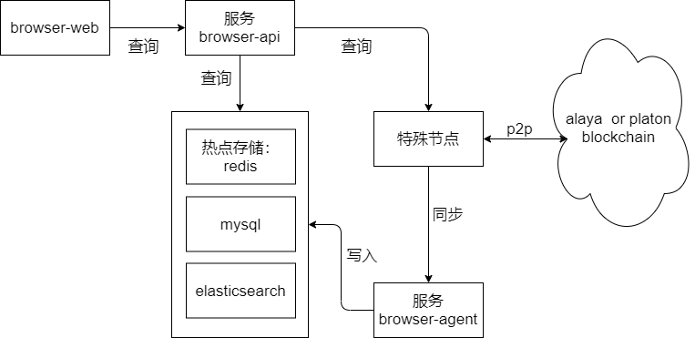

[Back to homepage](../../README.md)
### Overall structure

#### browser-web
> Alaya blockchain browser web version. [browser-web](https://github.com/Turnnetwork/browser-web)

#### browser-api
> Provide API query service for browser-web. Corresponds to [Interface Document](https://turnnetwork.github.io/browser-server/).

#### browser-agent
> Block synchronization analysis service, the main function is to collect and analyze block data, and finally store it in the database system

#### Special nodes
> Different from ordinary nodes, it provides interfaces such as batch query account balance interface and query history certifier list interface. [Special Node](https://github.com/Turnnetwork/Turn-Go/tree/special-alaya-develop)

#### data storage
##### redis
> Storage query of hotspot data

##### mysql
>Storage query of small table data

##### elasticsearch
> Storage query of large table data, such as blocks, transactions, etc.