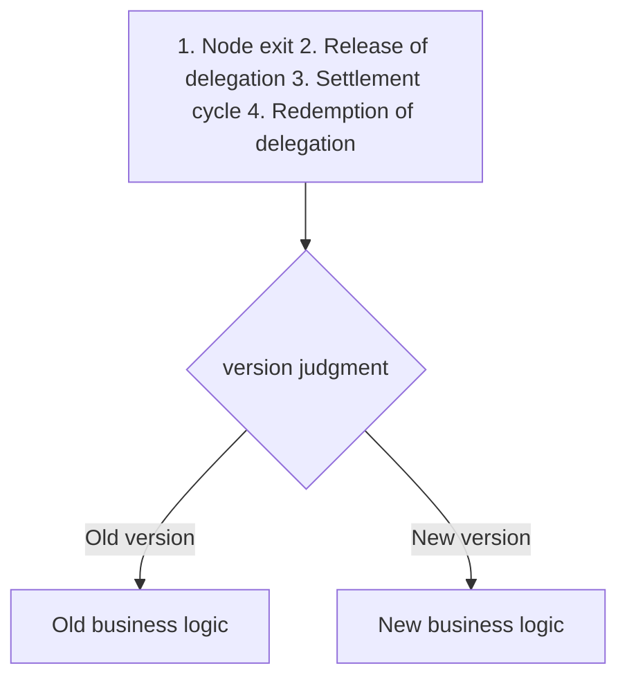
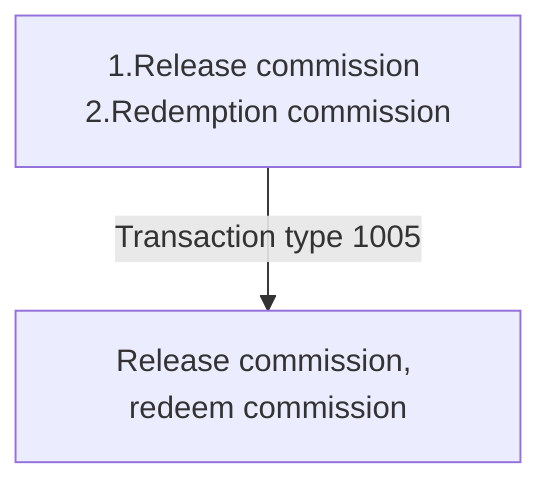
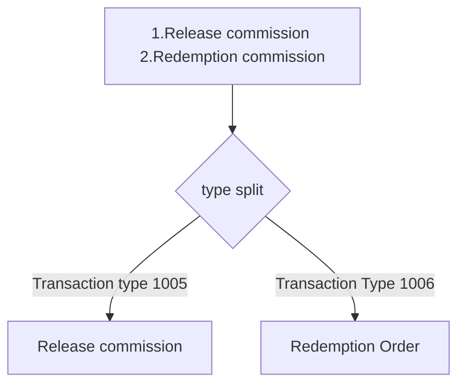

## 1. Process impact

### 1.Add active_version field to network table

    1) The active_version field stores the current effective version, and the initial version of the new chain in the configuration file.
    
    2) The program loads active_version configuration information into memory during initialization (first search the database, and if the query is null, load the initial version in the configuration file). When an upgrade proposal is approved, the active_version version number is updated.
    
    3) In the delegation locking process, in order to be compatible with the old version logic, version judgment needs to be done in the business logic [node exit], [delegation release], [settlement cycle], and [redemption delegation]. The process is as follows:



Pseudocode implementation (delegation release):

```java
    /**
* Delegation released
     *
     * @param event Collection event
     * @param tx transaction
     * @return com.turn.browser.bean.DelegateExitResult
     */
    @Override
    public DelegateExitResult analyze(CollectionEvent event, Transaction tx) {
        DelegateExitResult res = null;
        try {
            if (VersionEnum.compareVersion(VersionEnum.V01600.getVersion(), "0.15.2.0") < 0) {
                res = v01520DelegateExitAnalyzer.analyze(event, tx);
            } else {
                res = v01600DelegateExitAnalyzer.analyze(event, tx);
            }
        } catch (Exception e) {
            log.error("Analysis exception of the delegated business parameter converter", e);
        }
        return res;
    }
```
### 2. Split transaction types
(Release delegation) Original implementation logic:

Current version implementation logic:

Split the logic method according to transaction type into [1005-Release Commission] and [1006-Redemption Commission]


## 2. Field modification

### 1.ES field modification

| ES \*_transaction design |
| -------------------------------------------------- ---------- |
| 1.type=1005, add unFrozenNum to the field |
| ###### type=1005: Stake reduction/cancellation of delegation<br/>{<br/> "stakingBlockNum":111, //The unique identifier representing a certain pledge of a certain node<br/> " nodeId":"", //The pledged node Id (also called the candidate's node Id)<br/> "amount":"", //The amount of the reduction commission (based on the minimum unit, 1Turn = 10* *18 AAA)<br/> "nodeName":"", //<redundancy required>The name of the pledged node (with a length limit, indicating the name of the node)<br/> "realAmount":"", / /<Requires redundancy>Amount of actual holding reduction<br/> "delegateIncome":"" //Delegated income<br/> "unFrozenNum":1 //High freeze unlock block<br/>} |
| 2. Add new type type, type=1006 |
| ###### type=1006: Redemption Commission<br/>{<br/> "stakingBlockNum":111, //Represents the unique identifier of a certain pledge of a certain node<br/> "nodeId" :"", //The pledged node ID (also called the candidate's node ID)<br/> "nodeName":"", //<Requires redundancy>The name of the pledged node (with a length limit, indicating that The name of the node)<br/> "delegateIncome":"" //The income of the delegate<br/>} |
### 2.MySQL field modification

| MySQL field modification |
| -------------------------------------------------- ---------- |
| a. The governance parameter warehousing service has a new [undelegate freezing cycle number]: un_delegate_freeze_duration<br/>b. The delegation table has a new [undelegate effective block number] field frozen_end_block<br/>c. The delegation table has a new [freeze] Medium] field delegate_frozen<br/>d. The delegation table has a new field delegate_redeem<br/>e. The delegation table has a new field delegate_hes_invalid<br/>f. The address table has a new field delegate_hes_invalid<br/>f. The address table has a new field delegate_redeem<br/>e. Delegation] field delegate_frozen<br/>g, new [to be redeemed] field delegate_redeem<br/>h in address table, address table delegate_released changed to delegate_invalid<br/>i, pledge table, pledge history fields modified. stat_delegate_released was changed to stat_delegate_invalid (invalid delegation)<br/>j. Node table field modification. stat_delegate_released was changed to stat_delegate_invalid (invalid delegation)<br/>k. New active_version field was added to the network table |

Corresponds to sql

```sql
ALTER TABLE `delegation` ADD COLUMN `delegate_hes_invalid` DECIMAL ( 65, 0 ) DEFAULT 0 NOT NULL COMMENT 'Invalid Unlocked Delegation Amount (AAA)' AFTER `delegate_locked`,
CHANGE `delegate_released` `delegate_locked_invalid` DECIMAL ( 65, 0 ) DEFAULT 0 NOT NULL COMMENT 'Invalid locked delegation amount (AAA)' AFTER `delegate_hes_invalid`,
ADD COLUMN `delegate_frozen` DECIMAL ( 65, 0 ) DEFAULT 0 NOT NULL COMMENT 'Frozen' AFTER `delegate_locked_invalid`,
ADD COLUMN `delegate_redeem` DECIMAL ( 65, 0 ) DEFAULT 0 NOT NULL COMMENT 'to be redeemed' AFTER `delegate_frozen`,
ADD COLUMN `frozen_end_block` BIGINT ( 20 ) NULL COMMENT 'Delegation effective block number' AFTER `cur_delegation_block_num`;

ALTER TABLE `address` ADD COLUMN `delegate_frozen` DECIMAL ( 65, 0 ) DEFAULT 0 NOT NULL COMMENT 'Frozen delegate' AFTER `delegate_released`,
ADD COLUMN `delegate_redeem` DECIMAL ( 65, 0 ) DEFAULT 0 NOT NULL COMMENT 'Delegation to be redeemed' AFTER `delegate_frozen`;

ALTER TABLE `staking` CHANGE `stat_delegate_released` `stat_delegate_invalid` DECIMAL ( 65, 0 ) DEFAULT 0 NOT NULL COMMENT 'Invalid delegation (AAA)';

ALTER TABLE `node` CHANGE `stat_delegate_released` `stat_delegate_invalid` DECIMAL ( 65, 0 ) DEFAULT 0 NOT NULL COMMENT 'Invalid delegation (AAA)';

ALTER TABLE `staking_history` CHANGE `stat_delegate_released` `stat_delegate_invalid` DECIMAL ( 65, 0 ) DEFAULT 0 NOT NULL COMMENT 'Invalid delegation (AAA)';

ALTER TABLE `network_stat` ADD COLUMN `active_version` int(11) DEFAULT '0' NOT NULL COMMENT 'Current version number' AFTER `erc20_tx_qty`;
```


### 3. Modified fields related to the amount of the order form

| Field | Meaning | Explanation |
| ----------------------- | ------------- | ---------- -------------------------------------------------- |
| delegate_hes | Valid hesitation (AAA) | The newly added commission amount after the commission transaction is successful |
| delegate_hes_invalid | Failure hesitation (AAA) | The amount of [delegate_hes] is moved to [delegate_hes_invalid] due to node exit |
| delegate_locked | Effective lock (AAA) | The amount in the hesitation period becomes the effective locked delegation amount after the specified settlement period |
| delegate_locked_invalid | Invalid lock (AAA) | The amount of [delegate_locked] is moved to [delegate_locked_invalid] due to node exit |
| delegate_frozen | Freezing (AAA) | The amount in [delegate_locked] or [delegate_released] was moved to [delegate_frozen] due to the user's application to release the delegation |
| delegate_redeem | To be redeemed (AAA) | Due to the end of the freeze, the amount of [delegate_frozen] was moved to [delegate_redeem] |

### 4. Business logic field modification

#### 4.1 Node exit
| Module | Field Logic |
| -------- | ---------------------------------------- ------------------ |
| Delegation record | [delegate_hes] moved to [delegate_hes_invalid] -- the hesitation period delegation becomes the invalid hesitation delegation |
| Delegation record | [delegate_locked] moved to [delegate_locked_invalid] -- the lock period delegation becomes an invalid lock delegation |
| Pledge record | [stat_delegate_released (renamed to stat_delegate_invalid - invalid delegation)] plus delegated ([delegate_hes] + [delegate_locked]) -- keep the previous version logic |
| Pledge record | [stat_delegate_hes] minus the delegated [delegate_hes] -- keep the previous version logic |
| Pledge record | [stat_delegate_locked] minus the delegated [delegate_locked] -- keep the previous version logic |
| Node record | [stat_delegate_released (renamed to stat_delegate_invalid - invalid delegation)] plus delegated ([delegate_hes] + [delegate_locked]) -- keep the previous version logic |
| Node record | [stat_delegate_value] minus delegated ([delegate_hes] + [delegate_locked]) |
| Address record | [delegate_hes] minus the delegated [delegate_hes] -- keep the previous version logic |
| Address record | [delegate_locked] minus the delegated [delegate_locked] -- keep the previous version logic |
| Address record | [delegate_released (renamed to stat_delegate_invalid - invalid delegation)] plus delegated [delegate_locked] -- keep the previous version logic |


#### 4.2 Release of delegation

| Module | Field Logic |
| -------- | ---------------------------------------- ------------------ |
| Commission record | Calculation & record [Unfreeze effective block number: frozen_end_block] = ([Number of settlement cycles in which delegation is released] + [Number of settlement cycles in which delegation is released]) * [Number of blocks in each settlement cycle]) |
| Commission record | Commission record real release amount [realRefundAmount]: The hesitation period will be deducted first, and the lock will be deducted if the hesitation period is not enough<br/>1. The amount deducted from [delegate_hes] or [delegate_hes_invalid] will be credited directly to the account<br/>2. Hesitation If it is not enough, deduct the amount of [delegate_locked] or [delegate_locked_invalid] to [delegate_frozen] |
| Staking record | If the node has not exited: `stat_delegate_hes` = `stat_delegate_hes` - realRefundAmount hesitation period part |
| Staking record | If the node has not exited: `stat_delegate_locked` = `stat_delegate_locked` - realRefundAmount locked part |
| Staking record | If the node has exited: `stat_delegate_released` (renamed to stat_delegate_invalid - invalid delegation) = `stat_delegate_released` - realRefundAmount |
| Pledge record | New field stat_delegate_frozen = stat_delegate_frozen + realRefundAmount real frozen part |
| Node record | `total_value` = `total_value` - realRefundAmount |
| Node records | If the node did not exit: `stat_delegate_value` = `stat_delegate_value` - realRefundAmount |
| Address record | [delegate_hes] minus the delegated [delegate_hes] -- keep the previous version logic |
| Address record | If the node has not exited: [delegate_locked] - realRefundAmount locked part |
| Address record | If the node has exited: [delegate_released (renamed to stat_delegate_invalid - invalid delegation)] - realRefundAmount |
| Address record | New field: delegate_frozen = stat_delegate_frozen + realRefundAmount real frozen part |

#### 4.3 Settlement cycle

| Field logic |
| -------------------------------------------------- ---------- |
| If the switching block number of the current settlement cycle is equal to the commissioned [frozen_end_block], that is, the commissioned amount is frozen, then the subsequent steps will be performed |
| Commission record unfrozen amount unfrozenAmount: [delegate_frozen] is moved to [delegate_redeem], that is, [unfrozen amount] is moved to pending redemption |
| Staking and node records<br/>1.stat_delegate_redeem (new field) = stat_delegate_redeem + unfrozenAmount<br/>2.stat_delegate_frozen = stat_delegate_frozen - unfrozenAmount |

#### 4.4 Redemption Order

| Module | Field Logic |
| -------------- | ---------------------------------- -------------------------- |
| Commission record | [delegate_redeem] is set to zero (because the underlying redemption transaction does not specify the redemption amount) |
| Delegation record | If the amount of all the following fields is 0, the delegation is set to history:<br/>delegate_hes Valid hesitation (AAA) <br/>delegate_hes_invalid Invalid hesitation (AAA) <br/>delegate_locked Valid lock (AAA) <br/> />delegate_released invalid lock (AAA) <br/>delegate_frozen frozen (AAA) <br/>delegate_redeem pending redemption (AAA) |
| Staking and node records | stat_delegate_redeem (new field) = stat_delegate_redeem - delegated [delegate_redeem] |
| Staking and node records | Execute part of the logic for receiving rewards: `have_dele_reward` = `have_dele_reward` + reward amount |
| Staking and node records | Address table: Update the delegation reward field in StatisticsAddressConverter |

#### 4.5 Mission

| Field logic |
| -------------------------------------------------- ---------- |
| Address record: Add the update logic of [delegate_redeem] and [delegate_frozen] fields in AddressUpdateTask |

### 5. Front-end interface modification

| Interface | Return parameters                                                 |
| ------------------------------------- | ------------------------------------------------------------ |
| /staking/delegationListByStaking | {<br/> delegateAddr: delegate address (delegation table),<br/> delegateValue: delegation amount (delegation table delegate_hes+delegate_locked),<br/> delegateTotalValue: total amount delegated by the validator (staking Table delegate_hes+delegate_locked),<br/> delegateLocked: The locked delegate (Turn) is displayed normally if the associated certifier status is normal, and zero (delegation) if otherwise,<br/> delegateInvalid: The current certifier has expired delegate (field rename),<br/> delegateFrozen: freezing (new),<br/> delegateRedeem: to be redeemed (new),<br/>} |
| /staking/delegationListByAddress | { <br/> nodeId: node id, <br/> nodeName: node name, <br/> delegateValue: number of delegates (delegation table delegateHes+delegateLocked), <br/> delegateHas: unlocked delegation (Turn) If the associated certifier status is normal, it will be displayed normally. If it is otherwise, it will be zero (delegation). <br/> delegateLocked: Locked delegate (Turn) If the associated certifier status is normal, it will be displayed normally. If it is otherwise, it will be displayed normally. It is zero (delegation),<br/> delegateUnlock: Delegated (Turn) If the associated validator status is exiting or has exited, it is delegateHas+delegateLocked, if it is otherwise, it is 0 (delegation),<br/> delegateReleased: Delegation to be redeemed (Turn) (delegation table),<br/> delegateClaim: Delegation to be claimed (LAT),<br/> delegateFrozen: Freezing (new),<br/> delegateRedeem: To be redeemed ( New)<br/>} |
| /extra/queryConfig | New return field<br/>un_delegate_freeze_duration: number of undelegate freeze cycles |
| /transaction/transactionDetails | New return field<br/>unDelegateFreezeNum: Estimated unfreeze block height |
| /transaction/transactionList | txType:<br/>Transaction type, available values: 0-transfer,<br/>1-contract release (contract creation),<br/>2-contract call (contract execution),<br/> />4-Others,<br/>5-MPC transactions,<br/>6-erc20 contract creation,<br/>7-erc20 contract execution,<br/>8-erc721 contract creation,<br/>9 -erc721 contract execution,<br/>1000-initiate pledge (create validator),<br/>1001-modify pledge information (modify validator),<br/>1002-increase pledge (increase free pledge), <br/>1003-Withdraw pledge (withdraw from validator),<br/>1004-Initiate delegation (entrustment),<br/>1005-Reduce holdings/cancel delegation,<br/>1006-Redemption delegation,<br/> />2000-Submit a text proposal (create proposal),<br/>2001-Submit an upgrade proposal (submit a proposal),<br/>2002-Submit a parameter proposal (submit a proposal-remove it temporarily),<br/>2003- Vote for the proposal (proposal voting),<br/>2004-version statement,<br/>2005-cancel the proposal,<br/>3000-report multi-signature (report the verifier),<br/>4000-create a lockup Plan (Create Lockup),<br/>5000-Receive Rewards |
| /transaction/transactionListByBlock | txType:<br/>Transaction type, available values: 0-transfer,<br/>1-contract release (contract creation),<br/>2-contract call (contract execution),<br/ >4-Others,<br/>5-MPC transactions,<br/>6-erc20 contract creation,<br/>7-erc20 contract execution,<br/>8-erc721 contract creation,<br/>9- erc721 contract execution,<br/>1000-initiate pledge (create validator),<br/>1001-modify pledge information (modify validator),<br/>1002-increase pledge (increase free pledge),< br/>1003-Withdraw pledge (withdraw from validator),<br/>1004-Initiate delegation (commission),<br/>1005-Reduce/cancel delegation,<br/>1006-Redemption delegation,<br/ >2000-Submit a text proposal (create proposal),<br/>2001-Submit an upgrade proposal (submit a proposal),<br/>2002-Submit a parameter proposal (submit a proposal-remove it temporarily),<br/>2003-Give Proposal voting (proposal voting),<br/>2004-version statement,<br/>2005-cancel proposal,<br/>3000-report multi-signature (report validator),<br/>4000-create lock-up plan (Create a lock position),<br/>5000-Receive rewards |
| /transaction/transactionListByAddress | txType:<br/>Transaction type, available values: 0-transfer,<br/>1-contract release (contract creation),<br/>2-contract call (contract execution),<br/>4-other, <br/>5-MPC transaction,<br/>6-erc20 contract creation,<br/>7-erc20 contract execution,<br/>8-erc721 contract creation,<br/>9-erc721 contract execution,< br/>1000-Initiate pledge (create validator),<br/>1001-Modify pledge information (modify validator),<br/>1002-Increase pledge (increase free pledge),<br/>1003- Withdraw pledge (withdraw from validator),<br/>1004-Initiate delegation (delegation),<br/>1005-Reduce holdings/cancel delegation,<br/>1006-Redemption delegation,<br/>2000-Submit text Proposal (Create proposal),<br/>2001-Submit upgrade proposal (Submit proposal),<br/>2002-Submit parameter proposal (Submit proposal-remove temporarily),<br/>2003-Vote for proposal (Proposal vote ),<br/>2004-version statement,<br/>2005-cancel proposal,<br/>3000-report multi-signature (report verifier),<br/>4000-create lock-up plan (create lock-up) ,<br/>5000-Receive rewards |

## 3. Division of work

- 架构细化：                已完成

## 四、对用户影响

You need to clear the database first and then synchronize the data, otherwise data pollution will occur.